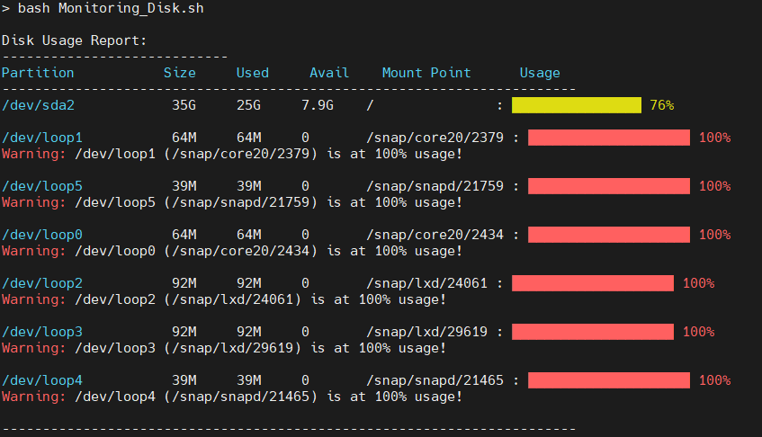

# Automation-Scripts


## 1. Disk Usage Monitor Script
### Overview
The Disk Usage Monitor script collects disk usage information and presents it in a visually appealing format with a bar graph display for each partition. This tool is useful for quickly assessing disk space usage across all partitions.

### Steps and Solution Explanation
#### Collect Disk Usage Data: 
The script runs ```df -h``` to gather disk usage information for each partition. The -h flag provides the output in a human-readable format.

#### Parse and Format Output: 
The output is processed to extract each partition's name, usage, and percentage. This ensures that all necessary details are included in the final output.

#### Visual Representation with Bar Graph: 
Each partition's usage percentage is displayed as a color-coded bar graph in the terminal, making it easy to identify high-usage areas at a glance. Spaces and formatting improvements are added for a more professional look.

#### Display Results: 
The formatted data and graphs are then printed to the terminal, offering a comprehensive view of the disk usage across partitions.


## 2. Docker Deployment Automation Script
### Overview
The Docker Deployment Automation script automates Docker build, versioning, and deployment. It allows for custom configurations such as Dockerfile path, ports, and incremental version tagging.

### Steps and Solution Explanation
#### Version Tagging: 
The script checks if a .version file exists. If it does, it reads the last version, increments it (e.g., v1.0 to v1.1), and saves the new version in the file. This ensures that each image has a unique tag.


#### Build Docker Image: 
The script builds a Docker image using the specified ```DOCKERFILE_PATH``` and ```BUILD_CONTEXT``` variables, allowing for custom configurations. The ```docker build``` command includes these paths to ensure flexibility in the build process.

#### Tag and Push to Docker Registry: 
If a registry name is provided, the script tags the image with the registry address and pushes it to the Docker registry. This step makes the versioned image accessible for deployment on other servers.

#### Run Docker Container: 
The script then runs the container, mapping the ```HOST_PORT``` to the ```CONTAINER_PORT```. This allows customization of port configurations for different environments or testing purposes.

#### Error Handling and Validation: 
After each major step (build, push, and run), the script includes error checks to validate that the commands executed successfully. This ensures that any failures in the process are reported clearly.


## Usage and Requirements
### Prerequisites:

For the Disk Usage Monitor script, you need awk installed.
For the Docker Deployment Automation script, you need Docker installed.

## Running the Disk Usage Monitor Script:
```bash
bash Monitoring_Disk.sh
```

## Running the Docker Deployment Automation Script:
```bash
bash Docker_Deployment.sh
```
